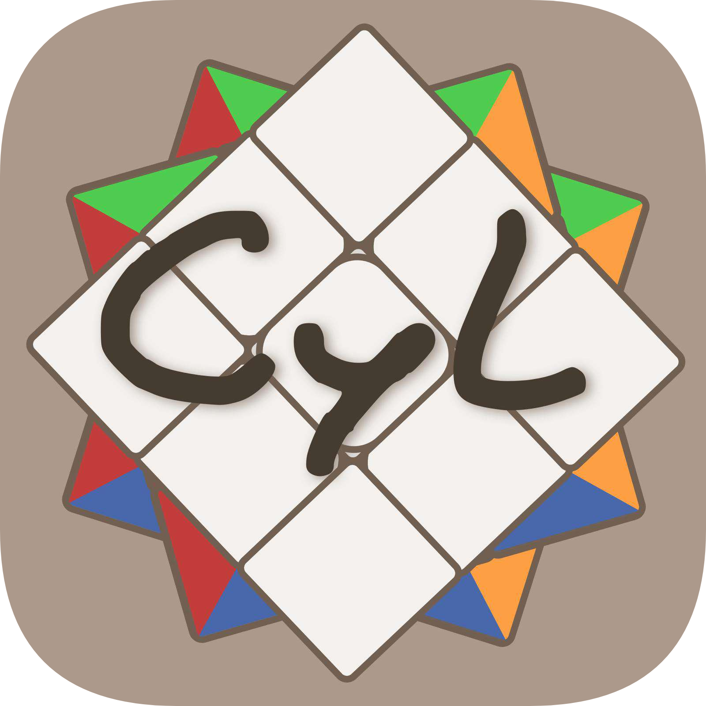

# WCA-CyL-Ranking

Aplicación Flutter para consultar el **ranking de speedcubers de Castilla y León** (España). Todos los datos se obtienen desde la **Unofficial WCA API**.

### Disclaimer

La aplicación no busca, bajo ningún concepto, remplazar los servicios oficiales ofrecidos por la WCA. La intención única es la de inspirar **competición sana** y **compañerismo** entre los _speedcubers_ de Castilla y León, a modo de motivación para la mejora personal.

## Descargas

<table>
 
  <tr>
    <td> <b>Android</b> </td>
    <td>
      
    </td>
  </tr>

  <tr>
    <td> <b>iOS</b>  (No disponible todavía) </td>
    <td>
      
    </td>
  </tr>

</table>

### Cómo instalar en Android

Si descargas el archivo `.apk`, sigue estos pasos:

1. **Descargar el archivo** desde el enlace anterior
2. **Activar instalación desde fuentes desconocidas**:
   - Ir a **Ajustes** → **Seguridad** (o **Privacidad y seguridad**)
   - Buscar **"Orígenes desconocidos"** o **"Instalar apps de fuentes desconocidas"**
   - Habilitar la opción para el navegador o gestor de archivos
3. **Abrir el archivo** `.apk` descargado con el gestor de archivos
4. **Pulsar "Instalar"** y esperar a que se complete. La aplicación se mostrará en la pantalla de inicio de su dispositivo.

> Este procedimiento es necesario al no distribuirse a traves de una _app store_, ya que se trata de una aplicación hobbista y sin ánimo de lucro, evitando así el gasto de subirla a una tienda oficial.

